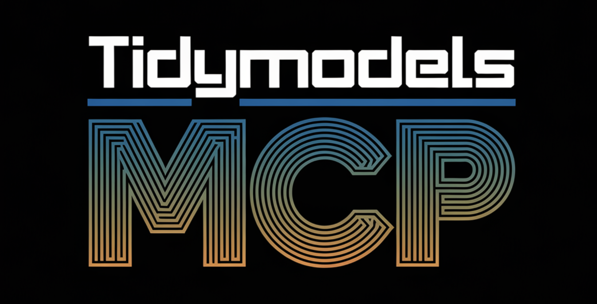

# Tidymodels MCP Server



A Model Context Protocol (MCP) server that provides tools and resources for working with the [tidymodels](https://www.tidymodels.org/) ecosystem in R.

## Overview

While this MCP server is extensible for use with tool-agnostic agentic AI workflows, in it's current form it can be paired with [Cline.bot](https://cline.bot/) and [Claude Desktop](https://claude.ai/download) as a local MCP server. The purpose of this MCP is to monitor the tidymodels ecosystem, specifically the GitHub repositories [under the tidymodels organization](https://github.com/tidymodels), providing comprehensive information about tidymodels packages, functions, and common workflows.

Currently, I'm getting better MCP performance when paired with Cline to:

- List all packages in the tidymodels ecosystem
- Provide detailed information about specific packages
- Search for R functions across tidymodels packages
- Generate template code for common tidymodels tasks
- Search for issues in tidymodels repositories

## Installation

### Prerequisites

- [Node.js](https://nodejs.org/) (v14 or later)
- [npm](https://www.npmjs.com/)

### Setup

1. Clone this repository:
   ```bash
   git clone https://github.com/yourusername/tidymodels-mcp.git
   cd tidymodels-mcp
   ```

2. Install dependencies:
   ```bash
   npm install
   ```

3. Build the server:
   ```bash
   npm run build
   ```

## Configuration

### GitHub Token (Optional)

The server can use a GitHub token to avoid rate limits when accessing the GitHub API. To provide a token:

1. [Create a personal access token](https://github.com/settings/tokens) with the `public_repo` scope.
2. Add it to your configuration as shown below.

### Adding to Cline in Visual Studio Code, Positron, and OSS Code IDEs

After you've installed Cline's VS Code extension, navigate to its MCP Servers marketplace where you can configure local MCP server settings. Then, add the JSON to Cline's `cline_mcp_settings.json` (if you want to autoapprove the core tools within this MCP server library, keep the names shown in the `autoApprove` list):

```json
{
  "mcpServers": {
    "tidymodels": {
      "command": "node",
      "args": ["/path/to/tidymodels-mcp/js/index.js"],
      "env": {
        "GITHUB_TOKEN": "your-github-token"
      },
      "disabled": false,
      "autoApprove": [
        "list_tidymodels_packages",
        "get_package_details",
        "search_r_functions",
        "generate_tidymodels_code",
        "search_issues"
      ]
    }
  }
}
```

### Adding to Claude Desktop

To use this MCP server with [Claude Desktop](https://claude.ai/download), add it to your `claude_desktop_config.json`:

```json
{
  "mcpServers": {
    "tidymodels": {
      "command": "node",
      "args": ["/path/to/tidymodels-mcp/js/index.js"],
      "env": {
        "GITHUB_TOKEN": "your-github-token"
      },
      "disabled": false,
      "autoApprove": []
    }
  }
}
```

The config file is typically located at:
- macOS: `~/Library/Application Support/Claude/claude_desktop_config.json`
- Windows: `%APPDATA%\Claude\claude_desktop_config.json`
- Linux: `~/.config/Claude/claude_desktop_config.json`

## Available Tools

The server provides the following tools:

### list_tidymodels_packages

Lists all packages in the tidymodels ecosystem.

```
Arguments:
- refresh (optional): Force a refresh of the repository cache
```

### get_package_details

Get detailed information about a specific tidymodels package.

```
Arguments:
- package (required): Package name
```

### search_r_functions

Search for R functions in tidymodels packages.

```
Arguments:
- query (required): Function name or keyword to search for
- package (optional): Limit search to a specific package
```

### generate_tidymodels_code

Generate R code for common tidymodels tasks.

```
Arguments:
- task (required): Description of the task
- template (optional): Type of template (recipe, model, tune, evaluation)
```

### search_issues

Search for issues in tidymodels repositories.

```
Arguments:
- query (required): Search query
- repo (optional): Limit search to a specific repository
- state (optional): Issue state (open, closed, all)
```

## Available Resources

The server also provides access to:

- All repositories in the tidymodels GitHub organization
- Documentation about tidymodels packages
- Template code for common tasks

## Usage Examples

Here are some examples of how to use this MCP server with Cline:

### Listing Tidymodels Packages

```
I'd like to know what packages are available in the tidymodels ecosystem.
```

### Getting Package Details

```
Can you tell me about the parsnip package in tidymodels?
```

### Searching for Functions

```
I need to find R functions related to cross-validation in tidymodels.
```

### Generating Code Templates

```
Generate code for a tidymodels workflow that predicts housing prices using random forests.
```

### Searching Issues

```
Show me open issues related to recipe preprocessing in tidymodels.
```

## Development

### Project Structure

- `js/`: Contains the JavaScript/Node.js server implementation
- `src/`: Contains the TypeScript source (if using TypeScript)
- `build/`: Output directory for build files

### Building from Source

If you've made changes to the TypeScript files, you can rebuild the server with:

```bash
npm run build
```

## License

This project is licensed under the MIT License - see the [LICENSE](LICENSE) file for details.

## Acknowledgments

- The [tidymodels](https://www.tidymodels.org/) team for their excellent R packages
- The [Model Context Protocol](https://docs.anthropic.com/claude/docs/model-context-protocol) for enabling enhanced AI capabilities
